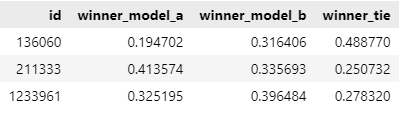

# LLM Classification Fine-tuning 项目

## 1. 项目介绍

本项目基于 **LLaMA 3** 进行 **文本分类任务** 的微调，目标是对 Chatbot Arena 采集的对话数据进行用户偏好预测。

比赛地址：[LLM Classification Finetuning](https://www.kaggle.com/competitions/llm-classification-finetuning)

**核心任务：**

- 采用 **LoRA (Low-Rank Adaptation)** 进行高效参数微调。
- 训练数据来自 **Chatbot Arena**，包含用户对两个模型的回答进行偏好选择。
- 训练任务是 **三分类问题**（模型 A 获胜、模型 B 获胜、平局）。
- 采用 **FP16 量化** 以减少显存占用。

## 2. 目录结构

```css
llm_classification/
├── data/                          # 数据存放目录
│   ├── train.csv                   # 训练数据
│   ├── test.csv                    # 测试数据
│   ├── sample_submission.csv        # 提交示例
│
├── kaggle-llm-sft-llama-3/         # 预训练 LLaMA 3 模型
│   ├── original/                    # 原始模型数据
│   ├── config.json                  # 模型配置
│   ├── tokenizer.json                # 分词器文件
│   ├── model.safetensors.index.json  # 量化模型索引
│
├── tokenizer/                      # 分词器数据
│   ├── tokenizer.json                # 分词器
│   ├── tokenizer_config.json         # 分词器配置
│
├── llm-pip/                         # 依赖安装包
│   ├── requirements.txt              # 依赖列表
│
├── .gitignore                       # Git 忽略文件
├── llama_3_finetuned_model.pth       # 微调后的 Lora 参数
├── llm-classification-finetuning.ipynb # 微调代码（Jupyter Notebook）
├── submission.csv                     # 预测结果提交文件
```

## 3. 环境准备

### 3.1 安装依赖

```shell
pip install --upgrade pip
pip install transformers bitsandbytes peft accelerate torch modelscope
```

### 3.2 下载 LLaMA 3 预训练模型

```bash
modelscope download --model LLM-Research/Meta-Llama-3-8B --local_dir ./kaggle-llm-sft-llama-3
```

## 4. 数据预处理

### 4.1 训练数据格式

数据集 `train.csv` 主要包含以下字段：

```
id,prompt,response_a,response_b,winner_model_a,winner_model_b,winner_tie
```

- `prompt`：用户问题
- `response_a`、`response_b`：模型 A 和模型 B 的回答
- `winner_model_a`、`winner_model_b`、`winner_tie`：标签（谁获胜）

### 4.2 预处理代码

```python
import pandas as pd

def preprocess(input_file):
    df = pd.read_csv(input_file)
    df['text'] = 'User prompt: ' + df['prompt'] + '\n\nModel A:\n' + df['response_a'] + '\n\n--------\n\nModel B:\n' + df['response_b']
    return df[['text', 'winner_model_a', 'winner_model_b', 'winner_tie']]

train_data = preprocess("data/train.csv")
```

## 5. 训练 LLaMA 3 分类模型

### 5.1 训练参数

- **batch_size**: 8
- **learning_rate**: 5e-5
- **epochs**: 1
- **LoRA 适配层**: `o_proj`, `v_proj`
- **设备**: `cuda:0`

### 5.2 训练代码

```python
from transformers import TrainingArguments, Trainer
from peft import LoraConfig, get_peft_model

# 配置 LoRA 训练参数
lora_config = LoraConfig(
    r=4, lora_alpha=8, lora_dropout=0.05,
    target_modules=['o_proj', 'v_proj'], task_type='SEQ_CLS')

model = get_peft_model(model, lora_config)
training_args = TrainingArguments(
    output_dir='output/', evaluation_strategy='epoch',
    save_strategy='epoch', learning_rate=5e-5, per_device_train_batch_size=16,
    per_device_eval_batch_size=16, num_train_epochs=1)

trainer = Trainer(
    model=model, args=training_args,
    train_dataset=train_data, tokenizer=tokenizer)

trainer.train()
trainer.save_model("llama_3_finetuned_model.pth")
```

## 6. 预测与提交

### 6.1 生成预测结果

```python
def inference(df, model, device, batch_size=BATCH_SIZE):
    input_ids = torch.tensor(df['INPUT_IDS'].values.tolist(), dtype=torch.long)
    attention_mask = torch.tensor(df['ATTENTION_MASKS'].values.tolist(), dtype=torch.long)
    
    generated_class_a = []
    generated_class_b = []
    generated_class_c = []

    model.eval()
    
    for start_idx in range(0, len(df), batch_size):
        end_idx = min(start_idx + batch_size, len(df))
        batch_input_ids = input_ids[start_idx:end_idx].to(device)
        batch_attention_mask = attention_mask[start_idx:end_idx].to(device)
        
        with torch.no_grad():
            with autocast():
                outputs = model(
                    input_ids=batch_input_ids,
                    attention_mask=batch_attention_mask
                )
        
        probabilities = torch.softmax(outputs.logits, dim=-1).cpu().numpy()
        
        generated_class_a.extend(probabilities[:, 0])
        generated_class_b.extend(probabilities[:, 1])
        generated_class_c.extend(probabilities[:, 2])
    
    df['winner_model_a'] = generated_class_a
    df['winner_model_b'] = generated_class_b
    df['winner_tie'] = generated_class_c

    torch.cuda.empty_cache()  

    return df


# 记录开始时间
st = time.time()

# 对整个数据集进行推理
data = inference(data, model, device)

# 打印总耗时
print(f"Processing complete. Total time: {time.time() - st}")
```

### 6.2 生成提交文件

```python
TARGETS = ['winner_model_a', 'winner_model_b', 'winner_tie']

sample_sub[TARGETS] = data[TARGETS]
display(sample_sub)
# 保存为 CSV 文件，设置行索引为第一列，保持原始第一行作为列索引
sample_sub.to_csv('submission.csv', header=True, index=False)
```

模型预测结果如下：



## 7. 未来优化方向

- **探索更大的 LLaMA 7B/13B 模型** 或者 微调后的 **Instruct 模型**
- **优化 LoRA 适配层，增加** `q_proj` **和** `k_proj`
- **尝试 Prompt Engineering 提高分类效果**